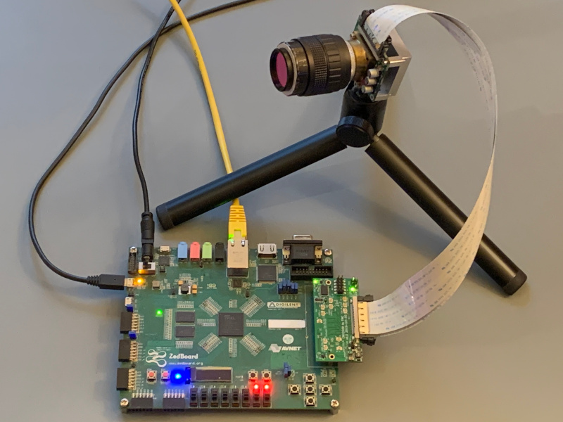
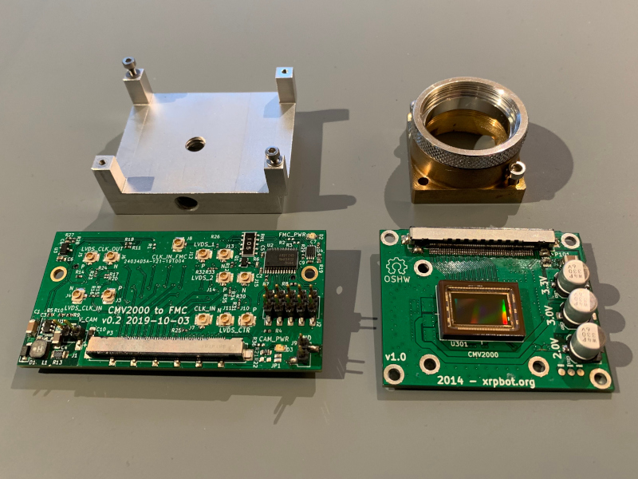

CMV2000 adapter kit
===================

This adapter kit allows connecting an [AMS CMV2000](https://ams.com/cmv2000)
image sensor to a ZedBoard (and probably other FPGA devboards) via the [FPGA
Mezzanine Card (FMC)](https://en.wikipedia.org/wiki/FPGA_Mezzanine_Card)
connector.

The CMV2000 is a high-speed image sensor intended for machine vision
applications (2 megapixels, 340 fps). While relatively expensive, it is one of
the few mid-range image sensors where reasonably complete documentation is
freely available (without NDA) from the manufacturer.

The hardware is split in two PCBs, connected by two high speed flat flex
cables. The first board contains the sensor, the second board connects to the
FMC port on the ZedBoard.

The sensor is powered by the ZedBoard, using the 12 V supply provided on the FMC
connector. Level shifters are used to translate all single-ended signals from
the FPGA I/O voltage to the 3.3 V used by the sensor.

The FMC board contains integrated 1k probes for some of the high-speed
differential signals. Additionally, a pin header allows probing the low-speed
single-ended signals.

For space reasons, the 1k probes use U.FL connectors for the connection to the
oscilloscope. The U.FL connectors have a very limited number of mating cycles
and the number of connections must therefore be kept to a minimum. Note that a
1k probe generally requires a termination (typically 50 Ω) at the oscilloscope;
with a high-impedance input, results will be very poor. If the 1k probes are
not required, the connectors and the corresponding resistors can simply be left
unpopulated.

See [pinmap.txt](pinmap.txt) for a list of connections from FPGA package pins
to camera pins.

Note that this repository uses submodules.

FMC board
---------

### Stackup

The FMC PCB is designed to be produced with 4 layers using the
[JLCPCB](https://jlcpcb.com/) JLC2313 stackup. (0.1 mm prepreg, εr =
4.05 between the outer and inner layer.)

Using the JLCPCB impedance calculator, the following trace parameters were obtained:

100 Ω differential:
4.00 mil (102 µm) trace width / 5.00 mil (127 µm) space

50 Ω single-ended:
5.78 mil (147 µm) trace width

These results were cross-checked using Maarten Baerts [AlterPCB
TLineSim](https://www.maartenbaert.be/alterpcb/tlinesim/) tool. In addition,
the influence of ground pour on the signal layer was investigated (using the
"Coplanar Waveguide" geometry). A distance of >= 200 µm between the edge of the
signal trace and ground seems to have little effect on the impedance.

### Vias

JLC multilayer: min. via drill: 0.2 mm, min. via diameter: 0.45 mm

Known issues
------------

* Sensor board: The 3.0 V rail is generated with an LDO (U202) from the 3.3 V
rail. However, this drop is too low for the LDO to properly operate. On the
physical board, this is fixed with a bodge wire connecting the input of U202 to
the 5.0 V rail instead. However, this fix is not contained in the schematic or
layout.

* After the sensor board PCB was produced, we found out that the intended
31-pin connector (P102) was no longer available. Thus, a 41-pin connector had
to be bodged on (sacrificing the I2C EEPROM). This change is not documented in
the schematic. However, when the current version of the FMC board was designed,
it was adapted to the situation and uses a 41-pin connector. The end result is
that the boards, as found in this repository, are incompatible: the sensor
board uses a 51-pin and a 31-pin connector, while the FMC board uses a 51-pin
and a 41-pin connector.
